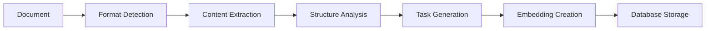

# 🚀 Task Flow PM

<div align="center">

[](https://opensource.org/licenses/MIT)
[](https://nodejs.org/)
[](https://www.typescriptlang.org/)
[](./docs/coverage.html)
[](https://github.com/diegonogueira/task-flow-pm/actions)

**🤖 Intelligent Task Management with AI-Powered Document Processing**

*Transform your documents into actionable tasks with 100% Node.js processing - No Python required!*

[📖 Documentation](./docs/) | [🚀 Quick Start](#quick-start) | [🎯 Examples](#examples) | [🤝 Contributing](#contributing)

</div>

---

## 📋 Table of Contents

- [✨ Features](#-features)
- [🚀 Quick Start](#-quick-start)
- [📦 Installation](#-installation)
- [🔧 Usage](#-usage)
- [📄 Document Processing](#-document-processing)
- [🌐 Multilingual Support](#-multilingual-support)
- [🏗️ Architecture](#️-architecture)
- [🔌 API Reference](#-api-reference)
- [🧪 Testing](#-testing)
- [🤝 Contributing](#-contributing)
- [📄 License](#-license)

## ✨ Features

### 🎯 **Core Capabilities**
- **📄 Universal Document Processing**: Support for DOCX, PDF, Markdown, HTML, JSON, and TXT files
- **🤖 AI-Powered Task Generation**: Automatically extract and create structured tasks from documents
- **🔍 Semantic Search**: Vector-based search using embeddings for intelligent task discovery
- **⏱️ Time Tracking**: Built-in time tracking with estimation variance analysis
- **📊 Knowledge Graph**: SQLite-based graph database for task relationships and dependencies
- **🌍 Multilingual CLI**: Full support for English and Portuguese commands

### 🛠️ **Technical Highlights**
- **🚫 Zero Python Dependencies**: 100% Node.js/TypeScript implementation
- **🔌 MCP Protocol**: Model Context Protocol integration for AI assistants
- **📱 Cross-Platform**: Works on Windows, macOS, and Linux
- **⚡ Performance**: Optimized with SQLite and efficient embeddings
- **🎨 Beautiful CLI**: Intuitive command-line interface with progress indicators

### 🔧 **Integration Ready**
- **📝 Cursor/VS Code**: Direct integration with popular editors
- **🤖 AI Assistants**: Compatible with GitHub Copilot and other AI tools
- **📊 Export Options**: JSON, HTML, Markdown output formats
- **🔗 Extensible**: Plugin-ready architecture for custom processors

## 🚀 Quick Start

### Prerequisites
- Node.js 18+ 
- npm or yarn

### Install and Run
```bash
# Clone the repository
git clone https://github.com/diegonogueira/task-flow-pm.git
cd task-flow-pm

# Install dependencies
npm install

# Initialize the project
npm run cli init

# Process your first document
npm run cli plan path/to/your/document.docx

# View generated tasks
npm run cli tasks
```

**That's it! 🎉** Your document is now converted into actionable tasks.

## 📦 Installation

### Option 1: NPM Package (Recommended)
```bash
npm install -g task-flow-pm
task-flow-pm init
```

### Option 2: From Source
```bash
git clone https://github.com/diegonogueira/task-flow-pm.git
cd task-flow-pm
npm install
npm run build
```

### Option 3: Docker
```bash
docker pull taskflowpm/task-flow-pm
docker run -v $(pwd):/workspace taskflowpm/task-flow-pm plan document.pdf
```

## 🔧 Usage

### Basic Commands

```bash
# Initialize project
task-flow-pm init

# Process documents
task-flow-pm plan specification.docx
task-flow-pm plan requirements.pdf

# Task management
task-flow-pm tasks                    # List all tasks
task-flow-pm tasks pending           # Filter by status
task-flow-pm next                    # Get recommended task
task-flow-pm begin <task-id>         # Start working
task-flow-pm complete <task-id> 120  # Mark done (120 min)

# Search and discovery
task-flow-pm search "authentication"
task-flow-pm details <task-id>
```

### Portuguese Commands
```bash
# Comandos em português
task-flow-pm inicializar
task-flow-pm planejar documento.docx
task-flow-pm tarefas
task-flow-pm proxima
task-flow-pm iniciar <id-tarefa>
task-flow-pm concluir <id-tarefa> 120
```

## 📄 Document Processing

### Supported Formats

| Format | Library | Features |
|--------|---------|----------|
| **DOCX** | mammoth | ✅ Text extraction, ✅ Formatting, ✅ Tables |
| **PDF** | pdf-parse | ✅ Multi-page, ✅ Text extraction, ✅ Metadata |
| **Markdown** | marked | ✅ Headers, ✅ Lists, ✅ Code blocks |
| **HTML** | cheerio | ✅ DOM parsing, ✅ Clean text |
| **JSON** | native | ✅ Structured data, ✅ Nested objects |
| **TXT** | native | ✅ Plain text, ✅ Encoding detection |

### Processing Pipeline



### Example: Processing a Requirements Document

```bash
# Input: requirements.docx
task-flow-pm plan requirements.docx

# Output: Structured tasks
✅ Epic: User Authentication System (1024min)
  ├── 📋 Story: Login Implementation (336min)
  │   ├── 🔧 Task: Design database schema (196min)
  │   ├── 🔧 Task: Implement login endpoint (72min)
  │   └── 🔧 Task: Create login UI (76min)
  └── 📋 Story: Security Features (688min)
      ├── 🔧 Task: Add password encryption (120min)
      └── 🔧 Task: Implement rate limiting (96min)
```

## 🌐 Multilingual Support

Task Flow PM provides full multilingual support:

### English CLI
```bash
task-flow-pm init
task-flow-pm plan document.pdf
task-flow-pm tasks pending
task-flow-pm next
```

### Portuguese CLI  
```bash
task-flow-pm inicializar
task-flow-pm planejar documento.pdf
task-flow-pm tarefas pendente
task-flow-pm proxima
```

### Configuration
```json
{
  "language": "pt-BR",
  "dateFormat": "DD/MM/YYYY",
  "timeFormat": "24h"
}
```

## 🏗️ Architecture

### High-Level Overview

```
┌─────────────────┐    ┌─────────────────┐    ┌─────────────────┐
│   CLI Interface │    │  Document       │    │  Task           │
│                 │───▶│  Processing     │───▶│  Management     │
│  • Commands     │    │                 │    │                 │
│  • I18n         │    │  • DOCX/PDF     │    │  • SQLite DB    │
│  • Validation   │    │  • Extraction   │    │  • Embeddings   │
└─────────────────┘    │  • Analysis     │    │  • Search       │
                       └─────────────────┘    └─────────────────┘
                                │
                       ┌─────────────────┐    ┌─────────────────┐
                       │   MCP Server    │    │  Integrations   │
                       │                 │    │                 │
                       │  • Protocol     │───▶│  • VS Code      │
                       │  • AI Bridge    │    │  • Cursor       │
                       │  • Context      │    │  • GitHub       │
                       └─────────────────┘    └─────────────────┘
```

### Technology Stack

- **Language**: TypeScript/Node.js 18+
- **Database**: SQLite with better-sqlite3
- **Embeddings**: all-MiniLM-L6-v2 model
- **Document Processing**: mammoth (DOCX), pdf-parse (PDF)
- **CLI**: yargs with multilingual support
- **Testing**: Vitest with coverage reporting
- **Build**: esbuild for fast compilation

### Project Structure

```
task-flow-pm/
├── 📁 bin/                 # CLI entry points
├── 📁 src/
│   ├── 📁 db/             # Database & embeddings
│   ├── 📁 services/       # Document processing
│   ├── 📁 mcp/           # MCP protocol implementation
│   └── 📁 i18n/          # Internationalization
├── 📁 docs/              # Documentation
├── 📁 scripts/           # Setup & utility scripts
├── 📁 __tests__/         # Test suites
└── 📁 examples/          # Usage examples
```

## 🔌 API Reference

### Document Processing API

```typescript
import { DoclingService } from 'task-flow-pm';

const docling = new DoclingService();

// Process document
const result = await docling.processDocument('path/to/doc.pdf', {
  generateTasks: true,
  generateContext: true,
  storyMapping: false
});

// Convert formats
const converted = await docling.convertDocument('input.docx', 'markdown');
```

### Task Management API

```typescript
import { TaskManager } from 'task-flow-pm';

const taskManager = new TaskManager();

// Create tasks
const task = await taskManager.createTask({
  title: 'Implement authentication',
  description: 'Add user login functionality',
  estimateMinutes: 240,
  priority: 'high'
});

// Search tasks
const results = await taskManager.search('authentication');
```

### MCP Integration

```typescript
import { MCPServer } from 'task-flow-pm';

const server = new MCPServer({
  port: 3000,
  dbPath: '.mcp/graph.db'
});

await server.start();
```

## 🧪 Testing

### Run Tests
```bash
# Run all tests
npm test

# Run with coverage
npm run test:coverage

# Run specific test suites
npm run test:docling
npm run test:cli
npm run test:integration

# Watch mode for development
npm run test:watch
```

### Test Document Processing
```bash
# Test with sample documents
npm run test:docling
```

### Example Output
```
🚀 Teste do Processamento de Documentos Node.js
==================================================
📋 Verificando documentos...
✅ docs/spec-test.docx - 333.3KB
✅ docs/spec-test.pdf - 1177.3KB

📄 Testando DOCX com mammoth...
✅ DOCX processado com sucesso!
   📊 5194 palavras extraídas
   🎯 5 tarefas geradas

📄 Testando PDF com pdf-parse...
✅ PDF processado com sucesso!
   📊 32 páginas, 5470 palavras
   🎯 1 tarefas geradas

💡 100% Node.js - SEM PYTHON!
```

## 🤝 Contributing

We welcome contributions! Please see our [Contributing Guide](./CONTRIBUTING.md) for details.

### Quick Contribution Steps

1. **Fork** the repository
2. **Clone** your fork: `git clone https://github.com/YOUR_USERNAME/task-flow-pm.git`
3. **Create** a feature branch: `git checkout -b feature/amazing-feature`
4. **Make** your changes
5. **Test**: `npm test`
6. **Commit**: `git commit -m 'Add amazing feature'`
7. **Push**: `git push origin feature/amazing-feature`
8. **Submit** a Pull Request

### Development Setup

```bash
git clone https://github.com/diegonogueira/task-flow-pm.git
cd task-flow-pm
npm install
npm run build
npm test
```

### Code Style
- Use TypeScript
- Follow ESLint configuration
- Add tests for new features
- Update documentation

## 📄 License

This project is licensed under the MIT License - see the [LICENSE](./LICENSE) file for details.

---

<div align="center">

**Made with ❤️ by the Task Flow PM Community**

[⭐ Star us on GitHub](https://github.com/diegonogueira/task-flow-pm) | [📝 Report Issues](https://github.com/diegonogueira/task-flow-pm/issues) | [💬 Join Discussions](https://github.com/diegonogueira/task-flow-pm/discussions)

</div> 